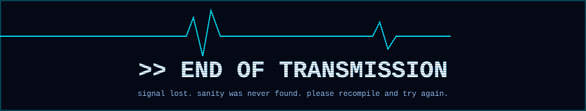

<div align="center">



<br/>

<a href="https://linkedin.com/in/sakshivermasv"></a>
<a href="https://sakshi-aiml-portfolio.vercel.app"></a>
<a href="https://github.com/SakshiVerma-19"></a>
<a href="mailto:sakshi.ve@outlook.com"></a>

</div>



I teach machines to read documents so I don't have to.

By day I build REST APIs with FastAPI. By night I negotiate with RAG pipelines until they stop making things up. I once helped ISRO look at satellites and worry about floods, which is a completely normal sentence now, apparently.

```console
$ whoami
sakshi_verma        # ai/ml engineer, professional argument-loser with APIs

$ cat education.txt
B.E. Artificial Intelligence & Machine Learning
Cambridge Institute of Technology, Bengaluru
CGPA 8.82           # the missing 1.18 is still out there. i have questions.
```



```console
$ git log --career --graph

* JUL 2026 -> NOW        Gen AI Intern, SmartSkale
|   - Alembic migrations, so the database stops surprising everyone
|   - URL-based job fetching (paste a link, get the job posting)
|   - mock-interview questions generated on the fly via the Groq API
|
* NOV 2025 -> FEB 2026   Systems Engineering & Data Analytics Intern, ISRO
    - flood-vulnerability models built from satellite imagery
    - live AWS IoT Core sensor pipelines with validation and anomaly
      detection, because sensors lie too
```







<div align="center">


</div>



```console
$ ls -la ./certs

System Design ................ GeeksforGeeks
Prompt Design in Vertex AI ... Google Cloud
Gen AI Academy ............... Hack2Skill
AI Foundation Associate ...... Oracle Cloud
Data Science for Engineers ... NPTEL
DSA with Java ................ NPTEL
```



Got an interesting problem, a weird dataset, or a RAG pipeline that's lying to you? [Say hi](mailto:sakshi.ve@outlook.com).

<br/>

<div align="center">

*"Gubbanubnub Dooraka."* - Birdperson

<sub>(translation unavailable, but I assume it means "your code compiled, don't get used to it")</sub>



</div>
